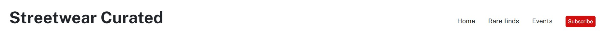
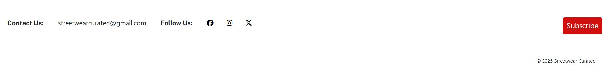

# Streetwear Curated Website

Streetwear Curated is a web-based fashion guide. The site showcases the latest streetwear styles and trends staying relevant with weekly updates. For streetwear collectors, there is a page with rare finds and for those looking to collaborate and socialise with other fashion forward individuals there is a fashion events page. Lastly to receive exclusive streetwear insights and expert recommendations, users have the option to subscribe.

The site can be accessed by this [link](https://munashemuk2.github.io/streetwear-curated/)

### Target audience:

- 16- 21-year-olds

- Location: London, York, Manchester and Glasgow

- Gender- Males

### User stories:

_First time visitors_

1. As a streetwear enthusiast I want an intuitive site layout and a navigation bar with key pages that will interest me

2. As a streetwear enthusiast I want to find out what streetwear curated offers

3. As a streetwear enthusiast I want to see streetwear curated ‘s social media following and engagement

_Returning visitors_

1. As a streetwear enthusiast, I want to see the latest fashion trend insights

2. As a streetwear enthusiast, I want to see updated content

_Frequent users_

1. As a streetwear enthusiast I want to receive exclusive content on a regular basis

2. As a streetwear enthusiast I want access to rare fashion that I can add to my collection

3. As a streetwear enthusiast, I want to collaborate/socialise with other fans, collectors and fashion forward individuals

## Features

+ ### Navigation bar

    - Placed at the top of the page along with the company logo "Streetwear Curated" on the left
    - Contains navigation links on the right side:
        * HOME - main page with featured streetwear and "about us" section for users to learn about Streetwear Curated
        * Rare finds - leads to the rare finds page where users can see exclusive and unique streetwear items
        * Events - the events page showcases upcoming streetwear events that bring together fans, collectors and fashion forward individuals
        * Subscribe - leads to the subscribe form page where users can fill out the form in order to receive newsletters
    - All links have animated hover effect.
    - The navigation is clear and easy to use.
    

    - The navigation bar is responsive:

        * On mobile devices: 
            - The full nav bar with text disappears and a  hamburger menu is implemented      
            
        
            - When the user clicks the hamburger menu , there is dropdown menu of all the page links including the call to action subscribe button at the bottom (located at the far right on larger screens)
            

---

+ ### Home Page

    - Features: 

        * Company introductory information and streetwear showcase
        * Streetwear imagery of exclusive items to draw users 
        * Three call to actions (subscribe button) on the nav, in the main section and in the footer

    

---

+ #### Rare finds

    - Rare finds page showcases rare items on the market users may be on the lookout for 

    - Features: 

        * Short description explaining the context of the page at the top
        * 3 exclusive rare items with descriptions 

    
    

--- 

+ #### Events page

    - Showcases upcoming events with imagery on the left hand side and descriptions on the right 

    - The events descriptions highlight what to expect from the events and also include the location details and when the events are occuring

    - There is also a main highlighted event in the middle to show users it is a new event on the scene 

    - Mainly for frequent users who will subsequently mention streetwear curated as their streewear information hub at the events 

    
    

---
+ #### Subscribe form / Call to Action Section

    - The call to action is the red subscribe button in the head and footer of every page. Also in the main content on the home page

    - The subscribe button is red to grab users attention. As a result, this will trigger stronger emotional responses from users that will lead to higher subscription rates 

    - The subscribe button leads to the subscribe form for users to sign up for newsletters

​
    
    
---
+ #### Response page

    - The response page is just a notification to the user that their submition to subcribe for newsletters is successful 

    - The page also encourages the users to remain on the site as there is a return to home button

​
    

---
+ #### Footer

    - Footer contains a contact email, social media links that open in new tabs and the call to action subscribe button on the far right along with copyright info on the bottom of the button
​
    
​
---
## Technologies Used

- [HTML](https://www.understandingcode.com/drop-down-navigation-bones/) - used for the drop down navigation
- [CSS](https://stackoverflow.com) - was used to add the styles and layout of the site (including CSS flexbox)
- [CSS roots](https://developer.mozilla.org/en-US/docs/Web/CSS/:root) was for global CSS variables. (edited to match wireframe)
- [Float and Clear](https://www.w3schools.com) CSS Layout - float and clear for rare finds page. 
- [Horizontally centering elements](https://jetthoughts.com/blog/how-horizontally-center-an-element-without-flex-css-html/) CSS Layout centering index.html elements
- [VSCode](https://code.visualstudio.com/)  Used as the main code editor
- [GitHub](https://github.com/) code host for the site
- [TinyPNG](https://tinypng.com/) used to compress the site images
- Code institute tutorials for social media icons 
---

### Solved bugs

1. Had an issue centering the 'return to home' button for the sucess page with margin auto so ended up putting the button in a div and using text align - center

2. subscribe button - was getting an error: The element button must not appear as a descendant of the a element.
solution - created anchor tag with subscribe in html and used styling to decorate it to look like a button

---
## Design

### Color Scheme

- The colour scheme for the site is red, white and black 

- Red – mainly used to catch users’ attention on the call to action to ‘subscribe’ which will drive engagement and subscribers 

- Black and white – used in order to make the content of the site the main focus and to make the site visually clean (due to the high usage of imagery to showcase different streetwear) 

### Typography

- Open sans Google Font was used as the main font  to increase readability of the content on the pages as this font's modern design is highly readable even at smaller sizes.

- Public sans Google Font was used to create a proffesional and contemporary look 

### Wireframes 

#### Mobile/Tablets/Desktop devices

- [Wireframe link](https://www.canva.com/design/DAGdUv1fnUs/Ca4QyP6N8gsRUMmfG0K4Sw/edit?utm_content=DAGdUv1fnUs&utm_campaign=designshare&utm_medium=link2&utm_source=sharebutton)

---

## Testing

Please refer to the [TESTING.md](testing.md) file for all test-related information 

---

## Deployment

### Deployment to GitHub Pages

- The site was deployed to GitHub pages. Using the following steps: 
  - In the [GitHub repository](https://github.com/MunasheMuk2/streetwear-curated), clicked on the Settings tab 
  - Selected the main branch under default branch and clicked on code 
  - Under deployments was a ribbon display to indicate the successful deployment.

The live link can be found [here](https://munashemuk2.github.io/streetwear-curated/)

### Local Deployment

In order to make a local copy of this project clone it in your IDE Terminal using the following command:

- `git clone https://github.com/MunasheMuk2/streetwear-curated`

---

## Future improvements
- add custom 404 page;
- improve the quality of the commit messages as I started with past tense and did not put capitals at the start
- add a vintage streetwear page with secondhand streetwear clothing and accessories 

---

### Content 

-  Events page text content from: https://www.swlondoner.co.uk/life/18092024-top-five-sneaker-and-street-fashion-events

-  Other text content written by myself and also AI generated

---

 #### Tools

    - [Adobe](https://www.adobe.com) Image resizing and cropping
    - [Favicon](https://favicon.io/favicon-converter/) resizing and shaping fav icons
    - [Canva](https://www.canva.com/) Wireframes, logo and favicon created in canva
    - [Crop-circle](https://crop-circle.imageonline.co/#google_vignette) fav icon circle cropper
  
---

### Media

- Images sourced from : https://unsplash.com/
- ReadMe responsive mock up from: https://ui.dev/amiresponsive
- testing.md gif from : gif maker (apple app)
---

### Credits

All work done by myself - my two accounts MunasheMuk and MunasheMuk2 showing in error in git hub as contributors

## Acknowledgments

- [Juliia Konovalova](https://github.com/IuliiaKonovalova) - My mentor- I have learned so many things within a short period of time. Espcially grateful for her guidance and always showing me best coding practices 
- [Code Institute](https://codeinstitute.net/) All slack community members willing to help at any time of the day. 

---