# TESTING

## Compatibility

In order to confirm the correct functionality, responsiveness, and appearance:

+ The website was tested on the most popular browsers : Chrome and internet explorer

    - Chrome:

    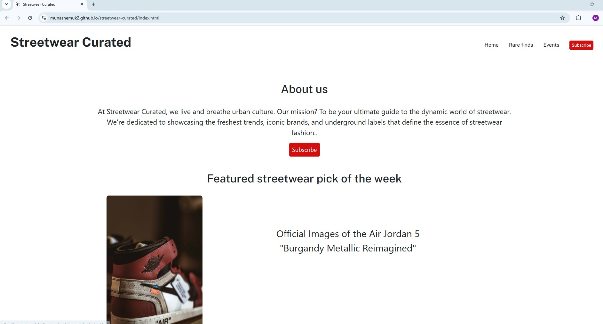

    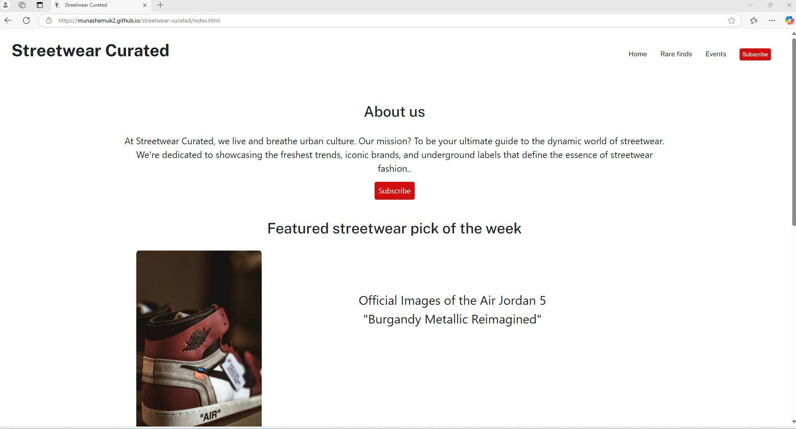

## Responsiveness

+ Also checked the website's responsiveness in devtools - Chrome.

    - Extra small devices:

    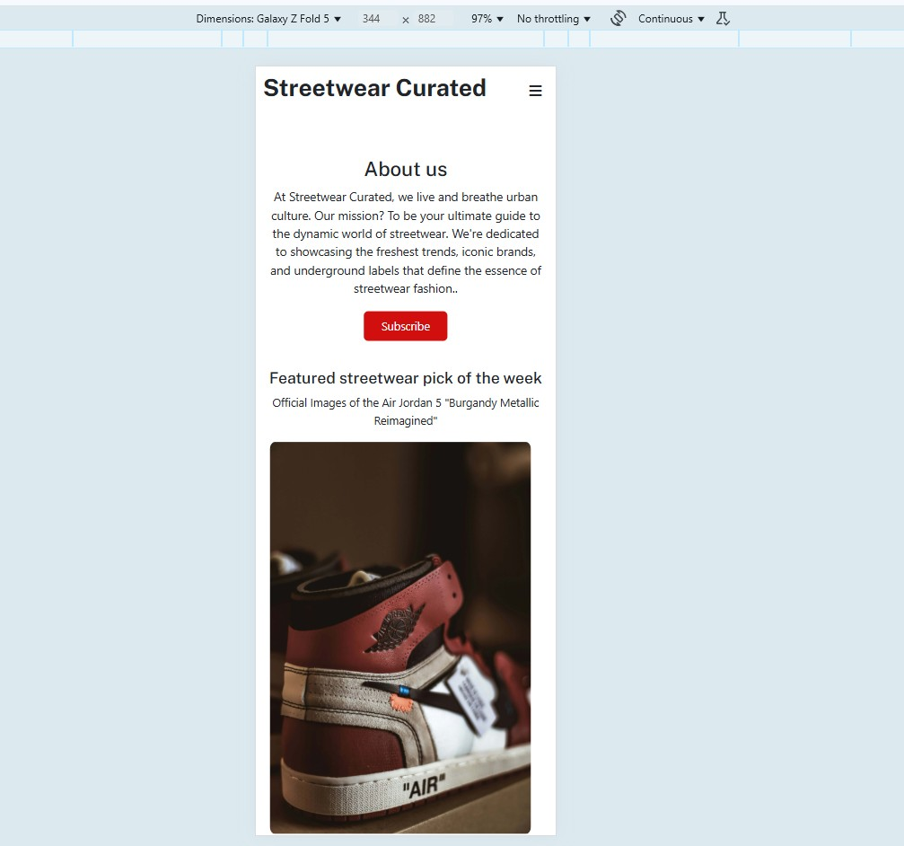

    - Small devices:

    

    - Medium devices:

    

    -  large devices:

    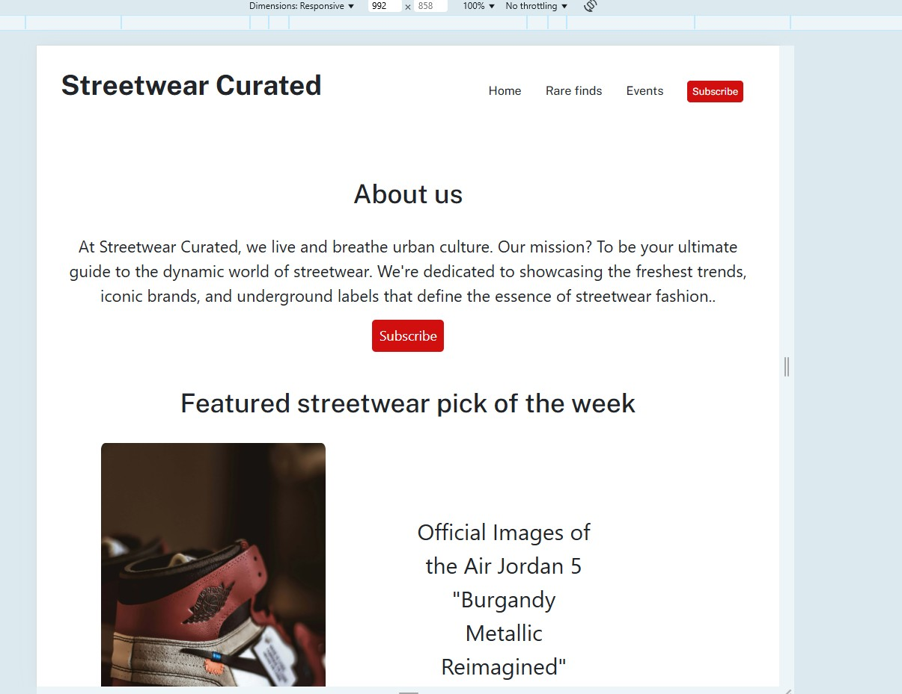
    
     -  Extra large devices:

    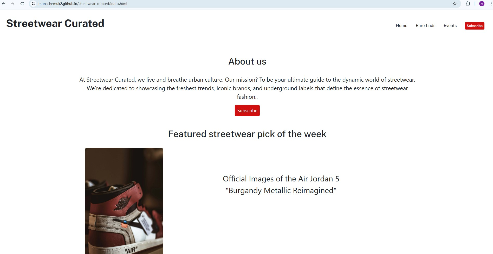

## Validator testing
+ ### HTML
  #### Home Page
    - No errors or warnings were found when passing through the official W3C validator.

    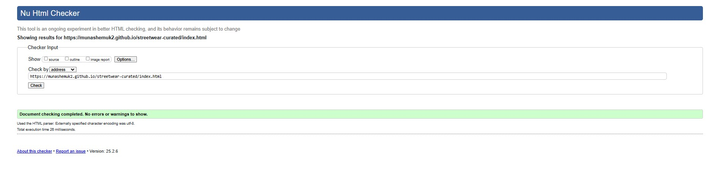

     - No errors or warnings were found when passing through the official W3C validator.

    
  #### Rare finds Page

    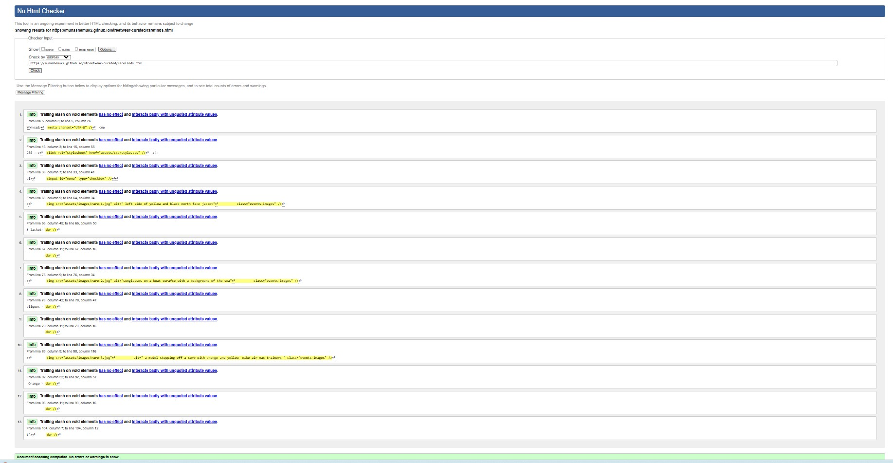

    - No errors or warnings were found when passing through the official W3C validator.

  #### Events Page

    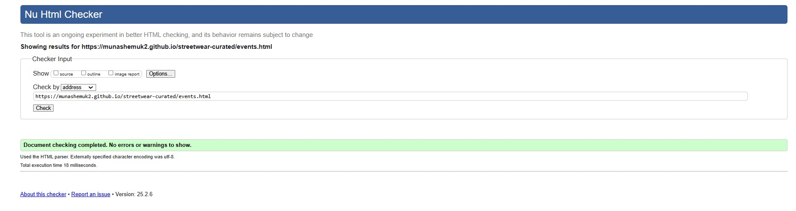

      - No errors or warnings were found when passing through the official W3C validator.

  #### Subscribe Page

    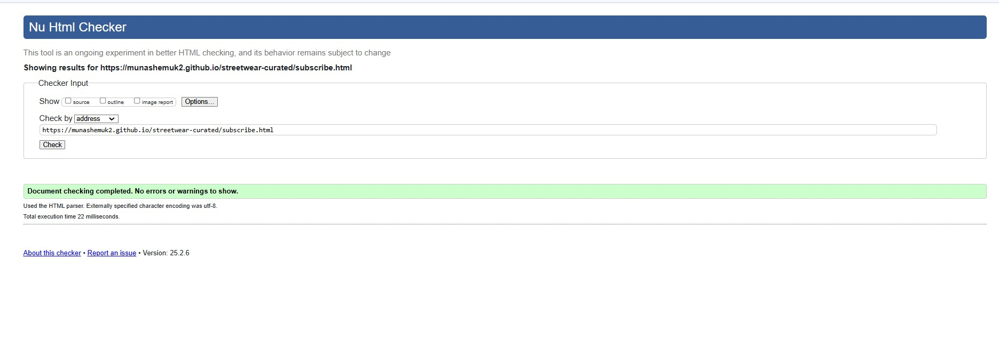

       - No errors or warnings were found when passing through the official W3C validator.

      #### Response Page

    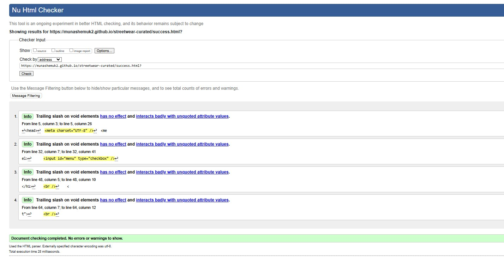

     - No errors or warnings were found when passing through the official W3C validator.
    
+ ### CSS
  No errors or warnings were found when passing through the official W3C (Jigsaw) validator 
    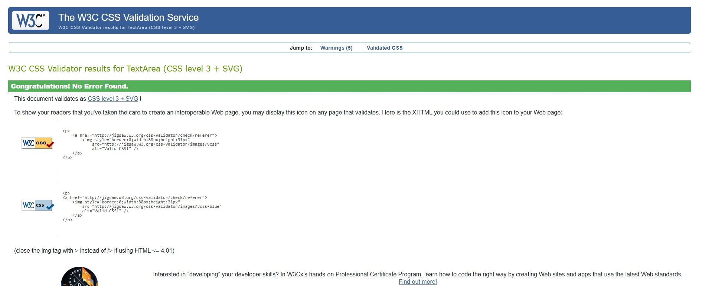
