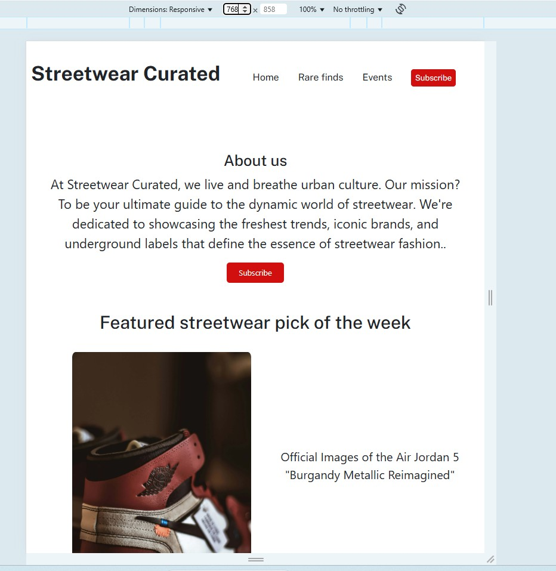
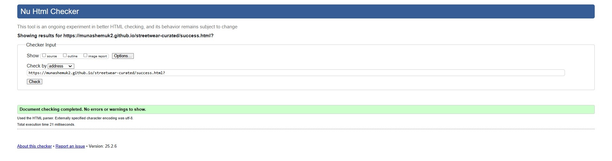

# TESTING

## Compatibility

In order to confirm the correct functionality, responsiveness, and appearance:

+ The website was tested on the most popular browsers : Chrome and internet explorer

    - Chrome:

    

    

## Responsiveness

+ Also checked the website's responsiveness in devtools - Chrome.

    - Extra small devices:

    

    - Small devices:

    

    - Medium devices:

    

    -  large devices:

    
    
     -  Extra large devices:

    

## Manual testing

| feature | action | expected result | tested | passed | comments |
| --- | --- | --- | --- | --- | --- |
| Navbar | | | | | |
| Home | Click on the "Home" link | The user is redirected to the main page | Yes | Yes | - |
| Rare finds | Click on the "Rare finds" link | The user is redirected to the rare finds page | Yes | Yes | - |
| Events | Click on the "Events" link | The user is redirected to the events page | Yes | Yes | - |
| Footer | | | | | |
| Facebook icon in the footer | Click on the Facebook icon | The user is redirected to the Facebook page | Yes | Yes | - |
| Instagram icon in the footer | Click on the Instagram icon | The user is redirected to the Instagram page | Yes | Yes | - |
| Twitter icon in the footer | Click on the Twitter icon | The user is redirected to the Twitter page | Yes | Yes | - |
| Subscribe buttons | | | | | |
| "Subscribe" button in Nav section (all pages) | Click on the "Subscribe" button | The user is redirected to the subscribe page | Yes | Yes | - |
| "Subscribe" button in main about us section | Click on the "Subscribe" button | The user is redirected to the subscribe page | Yes | Yes | - |
| "Subscribe" button in footer section (all pages)| Click on the "Subscribe" button | The user is redirected to the subscribe page | Yes | Yes | - |
| Subscribe page | | | | | |
| Full name input | Enter the full name | The full name is entered | Yes | Yes | If user doesn't enter their full name, a fill in this field message appears |
| Email input | Enter the email | The email is entered | Yes | Yes | If user doesn't enter the email, the error message appears. The error messgae also appears if the email is not a valid email |
| Main interest | Click on the dropdown selection | The dropdown provides options and select one option | Yes | Yes | These options are not required as the user can choose not to advise their main interest|
| "Submit" button | Click on the "Submit" button | The user is redirected to the response page | Yes | Yes | - |
| Response page | | | | | |
| Response message | click on return to home button | Once user clicks "return to home" button they are redirected to the home page | Yes | Yes | The return to home button keeps users engaged with the website|

## Validator testing
+ ### HTML
  #### Home Page
    - No errors or warnings were found when passing through the official W3C validator.

    

     - No errors or warnings were found when passing through the official W3C validator.

    
  #### Rare finds Page

    

    - No errors or warnings were found when passing through the official W3C validator.

  #### Events Page

    

      - No errors or warnings were found when passing through the official W3C validator.

  #### Subscribe Page

    

       - No errors or warnings were found when passing through the official W3C validator.

      #### Response Page

    

     - No errors or warnings were found when passing through the official W3C validator.
    
+ ### CSS
  No errors or warnings were found when passing through the official W3C (Jigsaw) validator 
    
