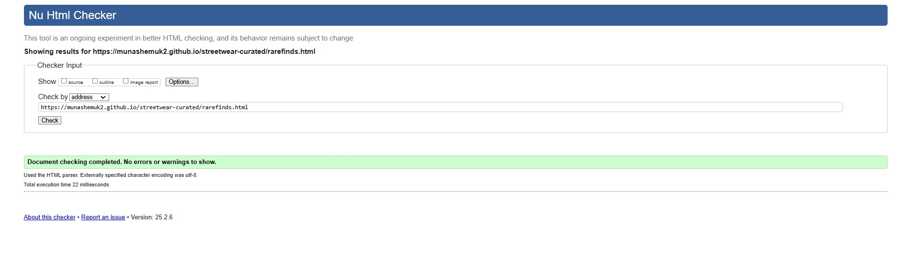

# TESTING

## Compatibility

In order to confirm the correct functionality, responsiveness, and appearance:

+ The website was tested on the following browsers: Chrome, Firefox, Brave.

    - Chrome:

    

    - FireFox:

    

    - Brave:

    

## Responsiveness

+ The website was checked by devtools implemented in Firefox and Chrome browsers.

    - Main Page:

    

    - Gallery Page:

    

    - Contact Page:

    

    - Response Page:

    

+ The website was checked with [Responsive Website Design Tester](https://responsivedesignchecker.com/).

    - Desktop Screens:

    
    
    
    
    
    
    
    

    - Tablet Screens:

    
    
    
    
    
    

    - Mobile Screens:

    
    
    
    
    
    
    

+ The functionality of the links in the website was checked as well by different users.

## Validator testing
+ ### HTML
  #### Home Page
    - No errors or warnings were found when passing through the official W3C validator.

    

     - No errors or warnings were found when passing through the official W3C validator.

    
  #### Rare finds Page

    

    - No errors or warnings were found when passing through the official W3C validator - just info advising trailing slash on void elements has no effect 

  #### Events Page

    

      - No errors or warnings were found when passing through the official W3C validator - just info advising trailing slash on void elements has no effect 

  #### Subscribe Page

    

      - No errors or warnings were found when passing through the official W3C validator - just info advising trailing slash on void elements has no effect 

      #### Response Page

    

      - No errors or warnings were found when passing through the official W3C validator - just info advising trailing slash on void elements has no effect 
    
+ ### CSS
  No errors or warnings were found when passing through the official W3C (Jigsaw) validator 
    
